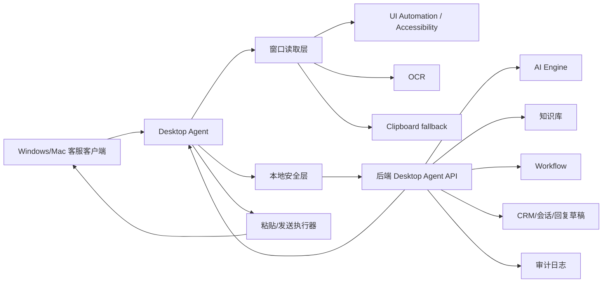

# AI 客服桌面自动化模块技术方案

更新时间：2026-07-20

## 1. 目标

在现有商家增长项目基础上新增“AI 客服桌面自动化模块”，实现企业客服窗口自动监听、AI 生成回复、知识库问答、受控自动发送、人工暂停和全链路日志。

本模块不替代现有 CRM、Workflow、Connector、回复草稿/外发队列能力，而是作为新的桌面 Agent 接入层，把桌面客户端里的消息转成后端可审计事件，再由现有 AI Engine、知识库、Workflow 和审计体系处理。

## 2. 现有基础

仓库内已经具备以下可复用能力：

- `scripts/desktop_auto_reply_listener.py`：已有 Windows 桌面监听雏形，支持 UI Automation、OCR、剪贴板回退、窗口白名单、粘贴、确认后发送、本地 JSONL 历史。
- `backend/platform/ai_engine.py`：已有统一 AI Engine，提供回复生成、意图评分、风险评估、总结等能力。
- `backend/customer_service_saas.py`：已有知识库、CRM 线索、回复草稿、回复外发、审计日志、Connector 只读消息等业务能力。
- `backend/platform/workflow.py`：已有 Workflow 引擎，支持 message/lead/schedule/manual 触发。
- `desktop/electron/`：已有桌面壳，但目前主要负责打开 Web 工作台，还没有启动/暂停本地 Agent 的 IPC 控制面。

## 3. 总体架构

### 3.1 设计原则

- 桌面端只负责读窗口、识别新消息、执行受控粘贴/发送。
- 后端负责 AI 决策、知识库注入、风控、审计、暂停状态、Workflow 触发。
- 默认模式为 `assist`，即只生成建议回复；自动发送必须显式开启。
- 自动发送必须同时满足窗口白名单、人工未暂停、风险通过、幂等未发送、频率限制、目标窗口仍一致。
- 所有动作必须记录本地日志和后端审计日志。
- 对 CRM/Workflow 只做加法扩展，不改写原有主流程。

## 4. 运行模式

| 模式 | 行为 | 适用场景 |
| --- | --- | --- |
| `assist` | 读取消息并生成建议回复，不碰客服窗口输入框 | 测试、演示、低风险上线初期 |
| `auto_paste` | 读取消息、生成回复、自动粘贴到输入框，不按发送 | 半自动客服，由人工看一眼后发送 |
| `auto_send` | 读取消息、生成回复、粘贴并发送 | 只允许在窗口白名单和风控通过时使用 |
| `paused` | 停止生成和发送，只记录心跳 | 人工接管或紧急停止 |

## 5. 桌面 Agent 设计

新增 `desktop_agent/` 包，将现有单文件脚本拆成可测试模块。

### 5.1 核心职责

- 启动时注册桌面会话，获取后端配置、暂停状态、发送策略。
- 周期扫描目标窗口。
- 读取聊天文本，规范化为消息事件。
- 基于内容 hash 和窗口 session 去重，避免重复回复。
- 将新消息提交后端，由后端返回回复动作。
- 按模式执行粘贴或发送。
- 回传动作结果和错误。
- 本地写 JSONL 日志，便于无网络时排查。

### 5.2 Windows 支持

保留并模块化当前 Windows 能力：

- `uiautomation` 读取窗口 UI 树文本。
- `pywin32`/`ctypes` 获取前台窗口、窗口标题、聚焦窗口。
- `pytesseract` + 截图做 OCR 回退。
- 剪贴板读取只作为低优先级 fallback，默认不读取非白名单窗口。
- 粘贴/发送通过剪贴板 + 快捷键执行，发送前再次校验窗口标题。

### 5.3 Mac 支持

新增 macOS adapter：

- 使用 Accessibility API 读取可访问文本。
- 使用 Quartz / ApplicationServices 枚举窗口和截图。
- OCR 优先使用系统截图 + `pytesseract`，后续可接 Apple Vision。
- 粘贴/发送通过系统剪贴板 + AppleScript/Quartz 事件执行。
- 启动前检测“辅助功能”和“屏幕录制”权限，未授权时给出明确诊断。

### 5.4 统一读取策略

读取顺序：

1. 平台原生 UI 树读取。
2. OCR 读取。
3. 剪贴板 fallback。

所有读取结果进入 `MessageNormalizer`：

- 删除浏览器/系统壳噪声。
- 判断是否像聊天内容。
- 提取最近客户消息。
- 生成 `message_hash`。
- 记录读取来源：`uia`、`ocr`、`clipboard`。

## 6. 后端控制面设计

新增 Desktop Agent 后端 API，路径建议统一放在 `/api/v1/desktop-agent/*`。

### 6.1 API

- `POST /api/v1/desktop-agent/sessions`
  - 注册桌面 Agent，返回 session_id、运行模式、暂停状态、发送策略。
- `POST /api/v1/desktop-agent/events`
  - 提交窗口读取到的新消息。
  - 后端生成 AI 回复、风险评估、知识库上下文，并返回下一步动作。
- `POST /api/v1/desktop-agent/actions/{action_id}/result`
  - 桌面端回传粘贴/发送结果。
- `POST /api/v1/desktop-agent/pause`
  - 人工暂停或恢复某个商户/渠道/窗口。
- `GET /api/v1/desktop-agent/state`
  - 查询当前模式、暂停状态、最近心跳、最近错误。
- `GET /api/v1/desktop-agent/logs`
  - 查询最近自动客服动作和审计摘要。

### 6.2 后端决策流程

1. 验证商户和 Agent session。
2. 检查暂停状态。
3. 检查窗口标题、渠道和平台白名单。
4. 对 `message_hash` 做幂等去重。
5. 调用知识库生成上下文。
6. 调用 `default_ai_engine().generate_reply(...)` 生成回复。
7. 调用 `default_ai_engine().assess_risk(...)` 风险评估。
8. 触发 `workflow_engine.trigger("message", "desktop_auto_reply", payload)`。
9. 写入审计日志。
10. 返回动作：
    - `none`
    - `draft_only`
    - `paste_reply`
    - `send_reply`
    - `handoff`

## 7. 知识库问答

优先使用后端现有知识库：

- 复用 `knowledge_context_for(merchant_id)`。
- 桌面端的 `knowledge_file` 只作为离线/本地调试 fallback。
- 后端生成回复时，把企业资料、商品信息、知识库、会话历史一并注入 AI Engine。
- 找不到知识答案时，回复应偏保守，并可触发人工接管。

## 8. 自动发送安全边界

自动发送不是默认开启能力，必须满足全部条件：

- 配置模式为 `auto_send`。
- 前端或配置明确开启自动发送。
- 后端未处于暂停。
- 当前窗口标题匹配 allowlist。
- 当前窗口 handle 或窗口标识和读取时一致。
- `message_hash` 未发送过。
- 距离上次发送超过 `min_send_gap_seconds`。
- AI 风险评估未命中高风险。
- 回复长度、敏感词、退款/赔付/承诺类表达通过检查。
- 发送前最后一次读取窗口标题仍然一致。

风险命中时返回 `draft_only` 或 `handoff`，不自动发送。

## 9. 人工暂停

暂停能力分三层：

- 后端暂停：商户/渠道/窗口级别暂停，所有 Agent 下发 `paused`。
- 本地暂停：本机 pause 文件或桌面端按钮，立即停止发送。
- 紧急停止：CLI 参数或 Electron IPC 停止 Agent 进程。

暂停后 Agent 仍可以上报心跳和日志，但不读取敏感窗口、不生成回复、不发送。

## 10. 日志与审计

### 10.1 本地日志

继续使用 JSONL，建议路径：

- `data/desktop-agent/history.jsonl`
- `data/desktop-agent/errors.jsonl`

日志字段：

- time
- session_id
- platform
- window_title
- source
- message_hash
- action
- result
- error

窗口原文默认只保留摘要和 hash；调试模式才保留截断文本。

### 10.2 后端审计

新增审计 action：

- `desktop_agent.session.start`
- `desktop_agent.message.read`
- `desktop_agent.reply.generated`
- `desktop_agent.reply.pasted`
- `desktop_agent.reply.sent`
- `desktop_agent.reply.blocked`
- `desktop_agent.paused`
- `desktop_agent.resumed`
- `desktop_agent.error`

审计日志复用 `record_audit_log(...)`，不要另起一套不可见日志。

## 11. 与 CRM / Workflow 的关系

本模块只做加法：

- 不修改现有 CRM lead/customer/task 主模型。
- 读取到强意向消息时，可通过 Workflow 创建 CRM 任务或线索。
- 每次桌面消息事件触发现有 Workflow 的 `message` 类型。
- AI 回复可以同步创建 reply draft，自动发送成功后再写 dispatch/action result。
- 不绕过现有审计、风控、用量统计。

## 12. 文件改造清单

### 12.1 新增文件

| 文件 | 用途 |
| --- | --- |
| `desktop_agent/__init__.py` | 桌面 Agent 包入口 |
| `desktop_agent/config.py` | Agent 配置、模式、平台白名单 |
| `desktop_agent/core.py` | 监听主循环和状态机 |
| `desktop_agent/api_client.py` | 后端 API 客户端 |
| `desktop_agent/normalizer.py` | 聊天文本清洗、hash、去重 |
| `desktop_agent/safety.py` | 发送门禁、本地暂停、频率限制 |
| `desktop_agent/logging.py` | 本地 JSONL 日志 |
| `desktop_agent/adapters/base.py` | 跨平台窗口读取和发送接口 |
| `desktop_agent/adapters/windows.py` | Windows UIA/OCR/发送实现 |
| `desktop_agent/adapters/macos.py` | macOS Accessibility/OCR/发送实现 |
| `desktop_agent/ocr.py` | OCR 公共封装 |
| `backend/desktop_agent.py` | 后端 Desktop Agent 服务、模型、业务函数 |
| `docs/AI客服桌面自动化模块技术方案.md` | 本技术方案 |
| `docs/AI客服桌面自动化验收清单.md` | 验收用例和上线门禁 |
| `scripts/desktop_agent_acceptance.py` | 跨平台 mock 验收脚本 |

### 12.2 修改文件

| 文件 | 改造内容 |
| --- | --- |
| `scripts/desktop_auto_reply_listener.py` | 改成薄 CLI wrapper，调用 `desktop_agent.core`，保留旧命令兼容 |
| `scripts/desktop_listener.config.example.json` | 新增 mode、pause_file、session、allowlist、redaction、rate limit、backend sync 配置 |
| `requirements.txt` | 增加 macOS 条件依赖和 OCR 通用依赖 |
| `backend/api_v1.py` | 挂载 `/api/v1/desktop-agent/*` 路由 |
| `backend/customer_service_saas.py` | 只补充可复用的审计/知识库/回复草稿调用，不改主结构 |
| `backend/platform/workflow.py` | 增加桌面消息默认 Workflow 定义或 action metadata，保持向后兼容 |
| `desktop/electron/main.cjs` | 增加启动/停止 Agent 子进程、读取状态日志的 IPC |
| `desktop/electron/preload.cjs` | 暴露安全的 `desktopAgent` 控制 API |
| `src/main.tsx` | 增加“桌面自动客服”控制面板：启动、暂停、模式、日志、最近动作 |
| `src/styles.css` | 增加控制面板样式 |
| `scripts/acceptance_check.py` | 纳入 Desktop Agent mock 验收 |
| `scripts/desktop_reply_e2e_acceptance.py` | 扩展为新后端 action/result 流程 |

### 12.3 数据表建议

如果使用现有 SQLite/MySQL 初始化机制，新增表建议集中放在 Desktop Agent 服务初始化中：

- `desktop_agent_sessions`
  - session_id
  - merchant_id
  - device_name
  - os
  - platform
  - mode
  - paused
  - last_heartbeat_at
  - created_at
  - updated_at

- `desktop_agent_events`
  - id
  - session_id
  - merchant_id
  - platform
  - window_title
  - source
  - message_hash
  - message_excerpt
  - status
  - created_at

- `desktop_agent_actions`
  - action_id
  - event_id
  - merchant_id
  - action
  - reply_text
  - risk_flags
  - status
  - result
  - created_at
  - updated_at

表为独立新增，不改变 CRM、Workflow、reply_dispatches 的原结构。

## 13. 开发阶段

### 阶段 A：后端控制面

- 新增 Desktop Agent API。
- 接入 AI Engine、知识库、Workflow、审计日志。
- 支持 session、event、action result、pause/state/logs。
- 自动发送只返回动作，不实际操作桌面。

### 阶段 B：桌面 Agent 模块化

- 从现有 `desktop_auto_reply_listener.py` 抽出 Windows adapter。
- 新增 core/config/safety/logging/api_client。
- 保留旧脚本入口，避免已有 bat 和 npm script 失效。

### 阶段 C：Mac adapter

- 新增 macOS Accessibility/Quartz adapter。
- 提供权限检测和 mock 测试。
- 在非 Mac 环境先完成单元/mock 验收，真实 Mac 权限验收单独执行。

### 阶段 D：前端/Electron 控制面

- Web 工作台展示桌面 Agent 状态、暂停按钮、模式、最近日志。
- Electron 增加启动/停止本地 Agent 的 IPC。
- 非 Electron 浏览器环境只展示后端状态，不启动本地进程。

### 阶段 E：受控自动发送验收

- mock 窗口验收：读取、生成、粘贴、发送结果回传。
- Windows 真实窗口验收。
- Mac 权限和 mock 窗口验收。
- 高风险文本阻断验收。
- 暂停和恢复验收。
- 重复消息幂等验收。

## 14. 验收标准

- Windows 可读取白名单窗口消息。
- Mac 可通过权限检测，并在 mock adapter 下完成完整链路。
- OCR 可作为 UI 读取失败后的 fallback。
- 所有 AI 回复通过 `AIEngine`。
- 回复能使用后端知识库上下文。
- 自动发送默认关闭，开启后受安全门禁约束。
- 人工暂停后不再生成、粘贴、发送。
- 本地和后端均有日志。
- CRM、Workflow 原有验收脚本不回退。

## 15. 第一阶段开发建议

先做“后端控制面 + Agent 模块骨架 + Windows adapter 迁移”，因为这一步能最快把现有 Windows 能力接入产品架构，同时不影响 CRM/Workflow。Mac adapter 和 Electron 控制面随后接上。
