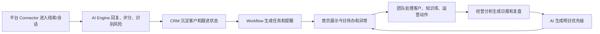

# 产品日活设计

## 1. 文档目的

本文件回答一个核心问题：

> 为什么企业团队每天都要打开 `AI 商家运营工作台`？

如果产品只是“有事时点一下 AI”，它就不是工作台，而是工具箱。

本产品的日活设计目标是：

```text
每天有新情况
每天有待办
每天有 AI 主动提醒
每天有经营报告
每天让团队少漏客户、少重复劳动、多沉淀经验
```

## 2. 高频页面和低频页面

### 2.1 高频页面

这些页面应该每天打开，属于首页一级入口。

| 页面 | 高频原因 | 主要用户 |
| --- | --- | --- |
| 首页驾驶舱 | 每天看经营状态、风险、AI 今日重点 | 老板、运营负责人、客服主管 |
| 获客中心 | 每天看新线索、来源、质量、待分配 | 运营负责人 |
| AI 客服 | 每天处理会话、人工接管、回复质量 | 客服主管、客服 |
| CRM | 每天跟进客户、更新阶段、查历史 | 运营、销售、客服主管 |
| 知识库 | 每天补高频问题、价格、售后、商品资料 | 客服主管、运营 |
| 自动化 | 每天看任务是否执行、失败、待确认 | 运营负责人 |
| 经营分析 | 每天看简报、日报、异常 | 老板、运营负责人 |

### 2.2 中频页面

这些页面每周或有活动时使用。

| 页面 | 使用场景 |
| --- | --- |
| 商品中心 | 上新、活动、商品资料变化、咨询异常 |
| AI 决策中心 | 复盘客户、商品、渠道和策略 |
| Connector 管理 | 新接平台、授权失效、平台规则变化 |

### 2.3 低频页面

这些页面不应占据主导航高权重。

| 页面 | 使用场景 |
| --- | --- |
| 企业设置 | 初始配置、账号变更 |
| 计费订阅 | 购买、续费、额度调整 |
| 开发者/API | 私有化、二开、技术客户 |
| 小程序配置 | 已确认做小程序渠道后 |
| 视频/图片生成高级设置 | 商品内容模块成熟后 |

## 3. 首页信息架构

首页应按“今天要处理什么”来排，而不是按功能模块平均分布。

建议首页从上到下分 6 层：

### 第一层：今日经营状态

放 6 个核心指标：

- 今日新线索
- 今日有效客户
- 今日会话
- AI 自动回复
- 待人工接管
- 高风险提醒

要求：

- 指标必须可点击。
- 点击后进入对应列表。
- 指标必须显示较昨日变化。

### 第二层：AI 今日重点

展示 AI 主动总结的 3-5 条重点：

- 今日最该处理的客户
- 今日最该补的知识库
- 今日最异常的渠道
- 今日最需要人工处理的会话
- 今日最值得跟进的商品/服务

要求：

- 每条建议必须有原因。
- 每条建议必须有下一步按钮。
- 不能只是“建议优化客服质量”这种空话。

### 第三层：待办任务流

把跨模块待办统一排在首页：

- 待分配线索
- 待人工接管会话
- 待跟进客户
- 待补充知识库
- 待确认自动化任务
- 待查看经营报告

要求：

- 每个待办有负责人。
- 每个待办有截止时间或优先级。
- 每个待办可标记完成。

### 第四层：获客和客服漏斗

展示从线索到会话再到客户的漏斗：

```text
Connector 来源
-> 新线索
-> 有效客户
-> 会话
-> 高意向
-> 待成交
```

要求：

- 能按平台筛选。
- 能按时间筛选。
- 能看到转化断点。

### 第五层：自动化和 Connector 状态

展示系统健康状态：

- Connector 是否正常。
- Workflow 今天运行了多少次。
- 失败任务。
- 待人工确认任务。
- AI Engine 是否正常。

要求：

- 不要让客户以为平台都已经自动接入。
- 状态必须明确：未配置、待授权、已连接、失败。

### 第六层：经营报告

展示：

- 今日简报
- 客服日报
- 获客日报
- CRM 跟进清单
- 知识库补充清单

要求：

- 报告要能导出。
- 报告要能复制给老板/团队。
- 报告要变成明天的任务输入。

## 4. AI 主动提醒设计

AI 不应该只是“用户问，AI 答”。

AI 应该主动做 5 件事：

### 4.1 主动发现异常

例子：

- 某渠道今天线索下降 40%。
- 某商品咨询变多但成交意向低。
- 客服人工接管比例突然升高。
- 某类售后问题集中出现。

### 4.2 主动生成待办

例子：

- “补充物流 FAQ。”
- “跟进 3 个高意向客户。”
- “复盘 2 条投诉会话。”
- “检查抖音来源线索质量。”

### 4.3 主动解释原因

不要只提示：

```text
有异常。
```

应该提示：

```text
今天拼多多来源有 12 条发货咨询，其中 8 条问到同一个问题：多久发货。
知识库里没有明确发货时效，所以 AI 多次使用兜底回复，建议补充发货 FAQ。
```

### 4.4 主动建议下一步

每条提醒都要对应动作：

- 查看会话
- 补充知识库
- 分配客户
- 标记人工接管
- 生成报告
- 创建 Workflow

### 4.5 主动形成复盘

每天结束时 AI 自动输出：

- 今天发生了什么。
- 哪些事 AI 已经处理。
- 哪些事需要人处理。
- 哪些知识需要沉淀。
- 明天优先做什么。

## 5. 日活循环

产品的日活不是靠“功能多”，而是靠循环。



## 6. 各模块日活职责

### 6.1 获客中心

日活职责：

- 显示新线索。
- 判断线索来源和质量。
- 分配给负责人。
- 转入 CRM。

高频动作：

- 标记有效/无效。
- 分配负责人。
- 查看来源渠道。
- 创建跟进任务。

### 6.2 AI 客服

日活职责：

- 自动处理普通咨询。
- 标记风险问题。
- 识别人工接管。
- 沉淀高频问题。

高频动作：

- 查看待人工接管。
- 抽检 AI 回复。
- 处理高风险会话。
- 把问题加入知识库。

### 6.3 CRM

日活职责：

- 统一客户池。
- 跟进状态。
- 会话历史。
- 商机推进。

高频动作：

- 更新客户阶段。
- 添加跟进记录。
- 查看高意向客户。
- 生成二次跟进任务。

### 6.4 知识库

日活职责：

- 让 AI 每天更懂业务。
- 接收客服高频问题。
- 维护价格、售后、商品和禁用承诺。

高频动作：

- 补充 FAQ。
- 审核 AI 建议的问题。
- 更新商品/价格/售后。
- 禁用错误话术。

### 6.5 自动化

日活职责：

- 把重复动作变成 Workflow。
- 让团队知道任务有没有跑。

高频动作：

- 查看失败任务。
- 确认待人工任务。
- 开关基础规则。
- 查看运行日志。

### 6.6 AI 决策中心

日活职责：

- 不是让用户每天写 prompt。
- 而是把 AI 判断结果分发给其他模块。

输出：

- 意向分
- 风险标签
- 客户分类
- 商品建议
- 渠道建议
- 明日优先级

### 6.7 经营分析

日活职责：

- 把一天的信息变成老板能看的报告。
- 把报告变成下一天任务。

高频动作：

- 查看日报。
- 导出报告。
- 复盘异常。
- 生成明日清单。

## 7. 首页第一版建议

V1 首页只做 5 个区域，避免复杂：

1. 今日指标卡
2. AI 今日重点
3. 待办任务
4. 最近会话和高意向客户
5. 今日经营简报

V1 不建议首页放：

- 大量商品媒体入口。
- 视频生成入口。
- 插件市场入口。
- 小程序配置。
- 复杂 BI 图表。

## 8. 日活验收标准

产品是否有日活，不看功能数量，看这 8 个问题：

1. 老板每天打开能不能 1 分钟知道今天重点？
2. 运营负责人能不能看到新线索和待跟进？
3. 客服主管能不能看到待接管和高风险会话？
4. AI 是否主动生成了待办？
5. 知识库是否因为真实会话每天变好？
6. CRM 是否沉淀客户，而不是只有聊天记录？
7. Workflow 是否减少重复动作？
8. 一天结束是否能生成报告和明日任务？

如果这 8 个问题没有跑通，就不要急着做更多平台和更多生成能力。

