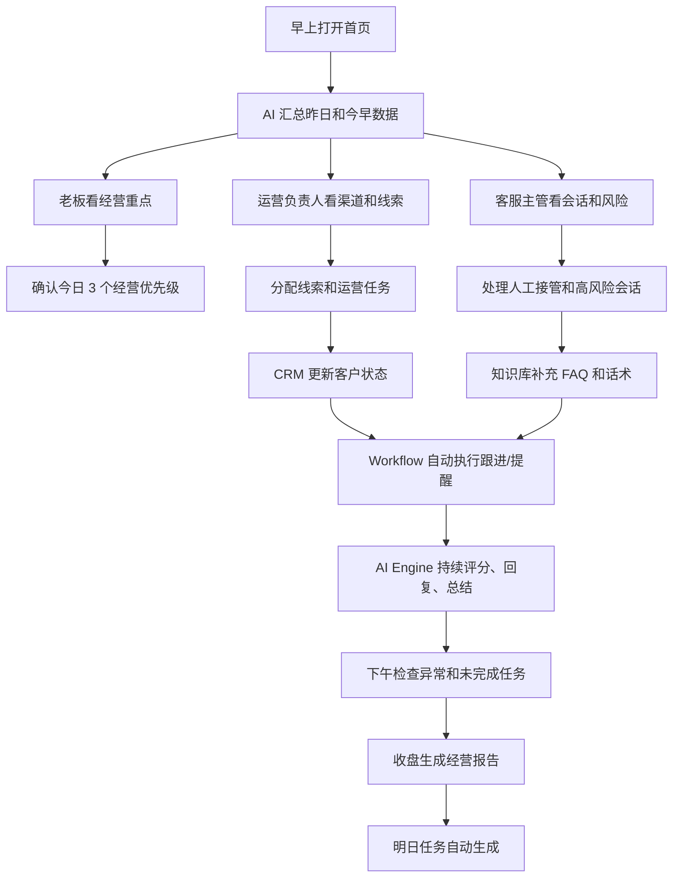

# 企业每日工作流

## 1. 文档目的

本文件定义 `AI 商家运营工作台` 在企业电商团队中的日常使用方式。

产品不是让用户“想起来才点一下 AI”，而是成为企业每天打开的运营驾驶舱：

```text
看今天有什么问题
-> 看 AI 已经处理了什么
-> 看哪些客户/线索/商品需要人介入
-> 安排今日任务
-> 收盘生成经营报告
```

## 2. 三类核心角色

### 2.1 企业老板

老板每天打开系统不是为了操作客服，而是为了回答 4 个问题：

1. 今天有没有新客户进来？
2. 客服有没有漏单、慢回、乱承诺？
3. 哪些商品、渠道、客户最值得继续投入？
4. 今天团队最该处理的 3 件事是什么？

老板首页应看到：

- 今日经营概览：线索数、有效客户数、会话数、AI 自动回复数、待人工处理数。
- 渠道表现：抖音、微信、企业微信、淘宝、拼多多、闲鱼、官网等 Connector 的线索和会话趋势。
- 风险提醒：退款、投诉、付款、隐私、账号、差评类高风险会话。
- AI 建议：今日最该跟进客户、最该优化商品、最该补充知识库的问题。
- 今日任务完成度：客服处理、线索跟进、知识库补充、自动化运行情况。

老板今天必须完成：

- 看 AI 生成的今日重点。
- 确认高风险会话是否已经有人接管。
- 查看新增高意向客户和重点商机。
- 看经营报告里的异常指标。
- 决定今天资源投向：投流、客服、商品、活动、售后。

AI 主动提醒：

- “今天抖音来源线索上涨，但客服接管率偏高，建议检查抖音话术。”
- “过去 24 小时有 6 条价格咨询未转化，建议补充价格 FAQ。”
- “有 3 个客户反复询问发货时间，商品知识库缺少物流说明。”
- “退款/投诉类消息增加，需要客服主管复盘。”

一天结束生成：

- 《今日经营简报》
- 《高意向客户清单》
- 《客服风险与漏单清单》
- 《知识库待补充问题》
- 《明日优先级建议》

### 2.2 运营负责人

运营负责人每天打开系统是为了协调增长、内容、商品和客服，不只是看客服聊天。

首页应看到：

- 今日渠道漏斗：曝光/访问/线索/会话/成交意向。
- 获客中心待处理线索。
- CRM 中需要跟进的客户。
- 商品中心中被频繁问到的商品。
- 自动化中心运行情况。
- AI 决策中心给出的运营建议。

运营负责人今天必须完成：

- 分配新线索给客服或销售。
- 查看不同渠道的线索质量。
- 处理 AI 标记的高意向客户。
- 根据客户问题更新知识库。
- 检查自动化任务是否正常运行。
- 安排次日活动、内容或商品优化动作。

AI 主动提醒：

- “闲鱼来源客户多问价格，但缺少套餐说明，建议新增报价话术。”
- “淘宝/拼多多售后咨询集中在发货和退换，建议补充售后政策。”
- “官网客服气泡有访问但留资少，建议调整欢迎语和 CTA。”
- “某商品被问 12 次但没有成交记录，建议优化卖点或价格解释。”

一天结束生成：

- 《渠道线索日报》
- 《客户跟进日报》
- 《商品问题汇总》
- 《运营动作清单》
- 《自动化运行日志》

### 2.3 客服主管

客服主管每天打开系统是为了保证服务质量、减少漏单、训练 AI 和安排人工接管。

首页应看到：

- 今日会话总量。
- AI 自动回复数。
- 待人工接管会话。
- 超时未处理会话。
- 高风险会话。
- 客服常见问题排行。
- AI 回复质量抽检入口。

客服主管今天必须完成：

- 处理待人工接管会话。
- 检查 AI 回复是否自然、准确、没有乱承诺。
- 标记错误回复并补充知识库。
- 查看客服高频问题。
- 把新问题沉淀为 FAQ。
- 复盘高意向客户是否被及时跟进。

AI 主动提醒：

- “有 4 条会话涉及退款/投诉，已标记人工接管。”
- “客户多次追问价格，知识库价格说明不够清楚。”
- “检测到 AI 回复中出现不确定表达，建议人工复核。”
- “有 2 个客户 30 分钟内未回复，建议优先处理。”

一天结束生成：

- 《客服质量日报》
- 《待补充知识库问题》
- 《人工接管复盘》
- 《AI 回复抽检结果》
- 《明日客服培训重点》

## 3. 首页完整信息架构

首页不是功能菜单堆叠，而是角色共同使用的经营驾驶舱。

建议首页分为 7 个区域：

1. 今日总览
   - 新线索
   - 有效客户
   - 会话数
   - AI 自动回复数
   - 待人工接管
   - 高风险提醒

2. AI 今日重点
   - 最重要 3 条经营建议
   - 最急需处理 3 条会话
   - 最值得跟进 3 个客户

3. 获客漏斗
   - 平台 Connector 来源
   - 线索质量
   - 转 CRM 数
   - 待跟进数

4. 客服工作台
   - 待人工接管
   - 超时未处理
   - 高频问题
   - AI 回复质量

5. CRM 待办
   - 今日新客户
   - 高意向客户
   - 待二次跟进客户
   - 丢单风险客户

6. 自动化运行
   - 今日 Workflow 运行次数
   - 失败任务
   - 待人工确认任务
   - 最近运行日志

7. 经营报告入口
   - 今日简报
   - 周报
   - 渠道报告
   - 客服报告
   - 商品问题报告

## 4. 企业一天完整流程



## 5. 高频日常任务

### 早会前

- 看 AI 今日重点。
- 看昨日遗留问题。
- 看高风险会话。
- 看新增高意向客户。

### 上午

- 运营负责人分配线索。
- 客服主管处理待人工接管。
- AI 自动回复普通咨询。
- CRM 记录客户状态。

### 下午

- 复查重点客户。
- 补充知识库。
- 检查 Workflow 失败任务。
- 处理渠道异常。

### 晚上/收盘

- 生成经营报告。
- 生成客服质量报告。
- 生成知识库补充清单。
- 生成明日优先级。

## 6. AI 主动提醒机制

AI 不应该等用户点按钮，而应该主动形成 5 类提醒：

1. 风险提醒
   - 退款、投诉、付款、账号、隐私、辱骂、差评。

2. 漏单提醒
   - 高意向客户长时间未跟进。
   - 客户问价格/下单/地址后无人接。

3. 知识库提醒
   - 同类问题反复出现，但知识库没有答案。
   - AI 多次使用兜底话术。

4. 渠道提醒
   - 某平台线索突然增加或下降。
   - 某平台会话质量低。

5. 经营提醒
   - 某商品咨询多但成交弱。
   - 售后问题集中。
   - 活动话术不清楚。

## 7. 一天结束的标准产物

每天系统必须自动生成：

- 今日经营简报
- 客服质量日报
- 获客渠道日报
- CRM 跟进清单
- 知识库待补充清单
- 自动化运行日志
- 明日优先级建议

这些报告不只是“数据展示”，而是企业第二天的行动清单。

