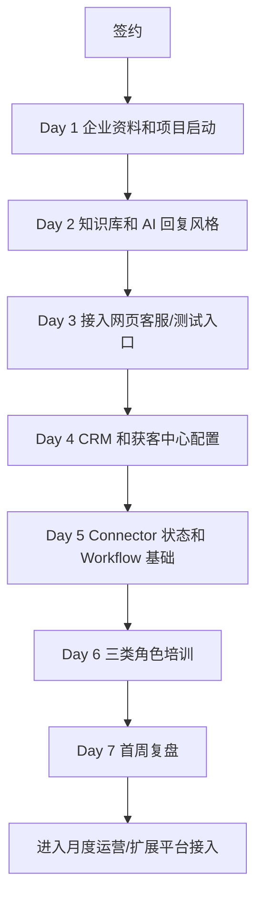

# 首个企业客户交付流程

## 1. 文档目的

本文件定义 `AI 商家运营工作台` 首个企业客户从签约到第一周复盘的标准交付 SOP。

首个企业客户不追求一次性接满所有平台，而是跑通最小闭环：

```text
企业资料
-> 知识库
-> AI 客服
-> CRM
-> 获客中心
-> 自动化基础
-> 经营报告
```

## 2. 首客交付原则

1. 先交付可用结果，再扩展平台。
2. 先接网页客服或一个低风险客服入口，再谈微信/抖音/淘宝等平台。
3. 先做人工可控，再做自动化。
4. 所有资料、话术、风险边界必须客户确认。
5. 所有自动化动作必须有日志。
6. 首周重点是验证客户真实工作流，不是堆功能。

## 3. 签约前准备

### 3.1 销售确认

签约前必须确认：

- 客户类型：企业电商团队 / 数字化运营团队。
- 当前主要平台：抖音、微信、企业微信、淘宝、拼多多、闲鱼、官网、小程序。
- 当前痛点：漏回、慢回、客服不专业、客户跟进混乱、知识库不统一、经营复盘缺失。
- 是否有官网或测试页面可以放客服气泡。
- 是否愿意先提供 FAQ、商品资料、售后政策。
- 是否接受第一阶段“人工确认 + AI 辅助”的交付边界。

### 3.2 签约包

签约时准备：

- 服务范围确认书。
- 平台接入边界说明。
- 客户资料收集表。
- 知识库模板。
- 首周验收标准。
- 数据安全说明。

## 4. Day 1：项目启动和资料收集

目标：建立企业账号，收齐基础资料。

交付动作：

1. 创建企业账号。
2. 建立企业基本资料：
   - 企业名称
   - 行业
   - 主营商品/服务
   - 目标客户
   - 价格/套餐
   - 优惠活动
   - 营业时间
   - 联系方式
3. 收集客服资料：
   - 高频问题
   - 标准回复
   - 禁止承诺
   - 售后政策
   - 退款规则
   - 发货/履约说明
4. 收集渠道资料：
   - 当前使用平台
   - 各平台账号负责人
   - 是否有官方 API 权限
   - 是否有客服后台权限

客户需要提供：

- FAQ 文档
- 商品/服务介绍
- 售后政策
- 当前客服话术
- 最近 20 条典型客户咨询
- 官网或测试页面地址

验收标准：

- 企业账号可登录。
- 企业资料完整度达到 80%。
- 至少导入 20 条知识库内容。
- 明确第一阶段接入入口。

## 5. Day 2：配置知识库和 AI 客服风格

目标：让 AI 能基于企业资料进行自然回复。

交付动作：

1. 导入知识库：
   - FAQ
   - 商品介绍
   - 价格说明
   - 售后政策
   - 禁止承诺
   - 客服 SOP
2. 配置 AI 回复风格：
   - 专业型
   - 成交型
   - 亲和型
   - 售后安抚型
3. 配置风险规则：
   - 退款
   - 投诉
   - 付款
   - 账号
   - 隐私
   - 差评
4. 配置人工接管规则。

内部测试：

- 普通咨询 5 条。
- 价格咨询 5 条。
- 售后咨询 5 条。
- 投诉/退款 5 条。
- 模糊需求 5 条。

验收标准：

- AI 回复不出现明显编造。
- 价格/售后/退款问题不乱承诺。
- 风险类问题能标记人工接管。
- 客户认可回复风格。

## 6. Day 3：接入客服入口

目标：让客户能真实体验 AI 客服。

推荐接入顺序：

1. 官网/测试页网页气泡。
2. 企业内部测试页面。
3. 低风险渠道的人工辅助回复。
4. 官方 API 渠道。
5. 桌面辅助脚本。

交付动作：

1. 生成客服气泡接入代码。
2. 放到客户测试页或官网。
3. 创建测试访客会话。
4. 验证会话进入收件箱。
5. 验证 AI 回复落库。
6. 验证人工接管标记。

验收标准：

- 客服气泡能打开。
- 访客能发消息。
- AI 能回复。
- 后台能看到会话。
- 刷新和重启后数据不丢。

## 7. Day 4：CRM 和获客中心配置

目标：把客服会话沉淀成客户和线索，而不是停留在聊天记录。

交付动作：

1. 配置线索来源：
   - 官网
   - 抖音
   - 微信
   - 企业微信
   - 淘宝
   - 拼多多
   - 闲鱼
2. 配置 CRM 字段：
   - 客户名称
   - 联系方式
   - 来源渠道
   - 意向分
   - 跟进状态
   - 最近会话
   - 负责人
3. 配置客户阶段：
   - 新线索
   - 已沟通
   - 高意向
   - 待报价
   - 已成交
   - 已流失
4. 配置基础跟进 SOP。

验收标准：

- 新会话能进入线索池。
- 高意向客户能被标记。
- 客户能进入 CRM。
- 客服/运营知道每天看哪里跟进。

## 8. Day 5：连接平台和自动化基础

目标：把平台接入定义成 Connector，不把业务写死到平台里。

平台连接分 4 个状态：

1. 未配置
2. 待授权
3. 已连接
4. 失败/受限

交付动作：

1. 梳理客户当前平台。
2. 每个平台标记连接状态。
3. 对有官方能力的平台，准备 API 接入资料。
4. 对暂无官方 API 的平台，只做人工辅助或桌面辅助。
5. 配置基础 Workflow：
   - 新线索进入 CRM
   - 风险会话提醒人工
   - 高频问题进入知识库待补充
   - 每日生成经营简报

验收标准：

- 每个平台状态清晰。
- 不对客户承诺未获得权限的平台自动收发。
- Workflow 能产生运行记录。
- 失败任务能被看到。

## 9. Day 6：培训使用

目标：让企业老板、运营负责人、客服主管都知道每天怎么用。

### 老板培训

重点讲：

- 首页怎么看。
- AI 今日重点怎么看。
- 经营报告怎么看。
- 风险提醒怎么看。
- 什么时候需要拍板。

### 运营负责人培训

重点讲：

- 获客中心怎么看线索。
- CRM 怎么分配客户。
- 自动化中心怎么看任务。
- 知识库怎么补充。
- 渠道表现怎么看。

### 客服主管培训

重点讲：

- 会话收件箱怎么处理。
- AI 回复怎么抽检。
- 人工接管怎么处理。
- 风险会话怎么复盘。
- 高频问题怎么沉淀为知识库。

培训验收：

- 每个角色能独立完成当天 3 个核心动作。
- 客户能说清楚系统每天打开的原因。
- 客户知道哪些能力已经可用，哪些能力还未接入。

## 10. Day 7：第一周复盘

目标：判断首周是否跑通企业真实工作流。

复盘内容：

1. 数据复盘
   - 新线索数量
   - 会话数量
   - AI 自动回复数量
   - 人工接管数量
   - 高风险会话数量
   - CRM 跟进数量

2. 质量复盘
   - AI 回复是否自然
   - 是否有乱承诺
   - 是否有漏回
   - 是否有客户不满意

3. 运营复盘
   - 哪些渠道有效
   - 哪些商品被频繁咨询
   - 哪些问题需要补知识库
   - 哪些自动化任务有价值

4. 下一阶段计划
   - 增加哪个 Connector
   - 补充哪些知识库
   - 开启哪些 Workflow
   - 是否进入月度托管

第一周复盘输出：

- 《首周使用复盘报告》
- 《知识库优化清单》
- 《客户跟进清单》
- 《渠道接入计划》
- 《第二周实施计划》

## 11. 首客交付总流程



## 12. 交付边界

首个企业客户不能承诺：

- 自动发布商品。
- 自动改价。
- 自动退款。
- 自动处理付款。
- 未授权平台的后台私信自动收发。
- 无人值守模拟真人发送。
- 一定提升销售额。

可以承诺：

- 搭建企业 AI 客服工作台。
- 导入知识库。
- 网页客服自动回复。
- 会话和客户沉淀。
- 高风险问题提醒。
- 基础自动化运行记录。
- 每日经营报告。
- 第一周复盘和优化建议。

